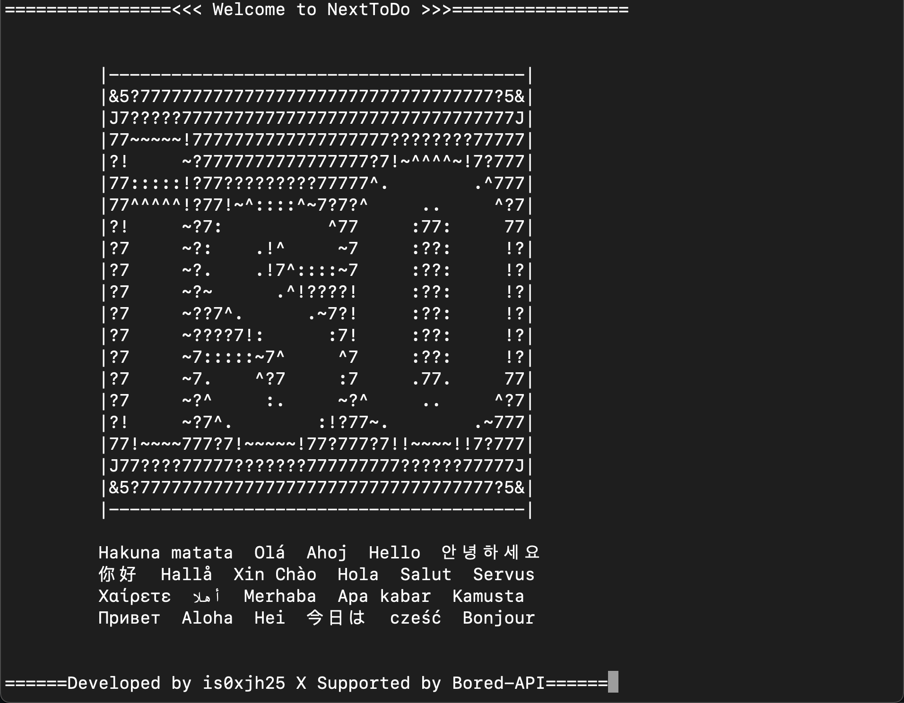
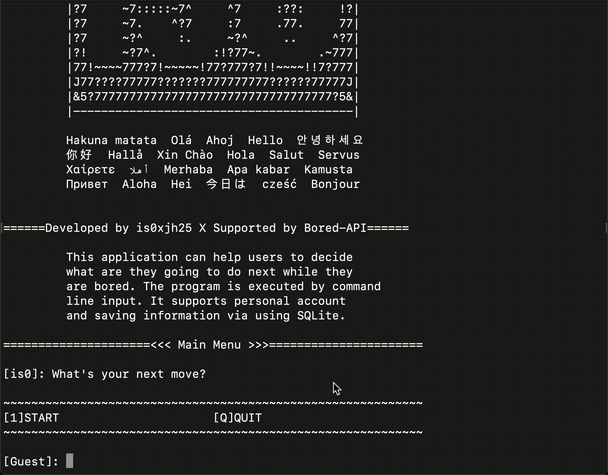
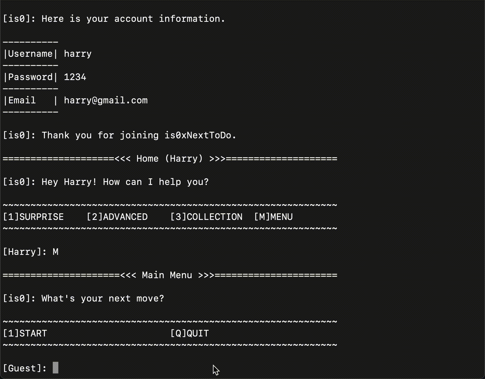
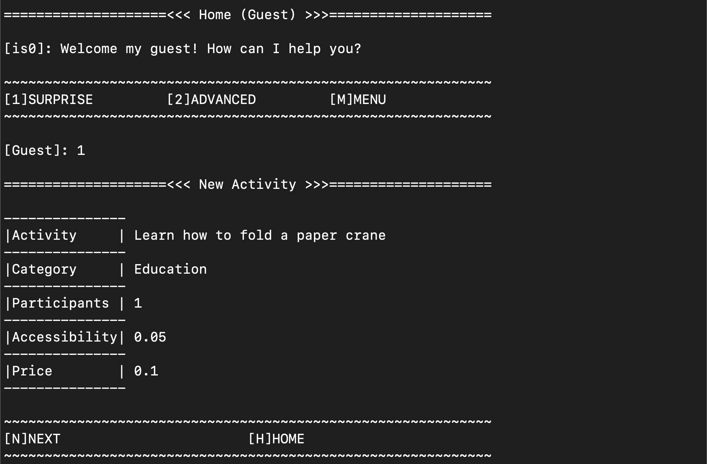
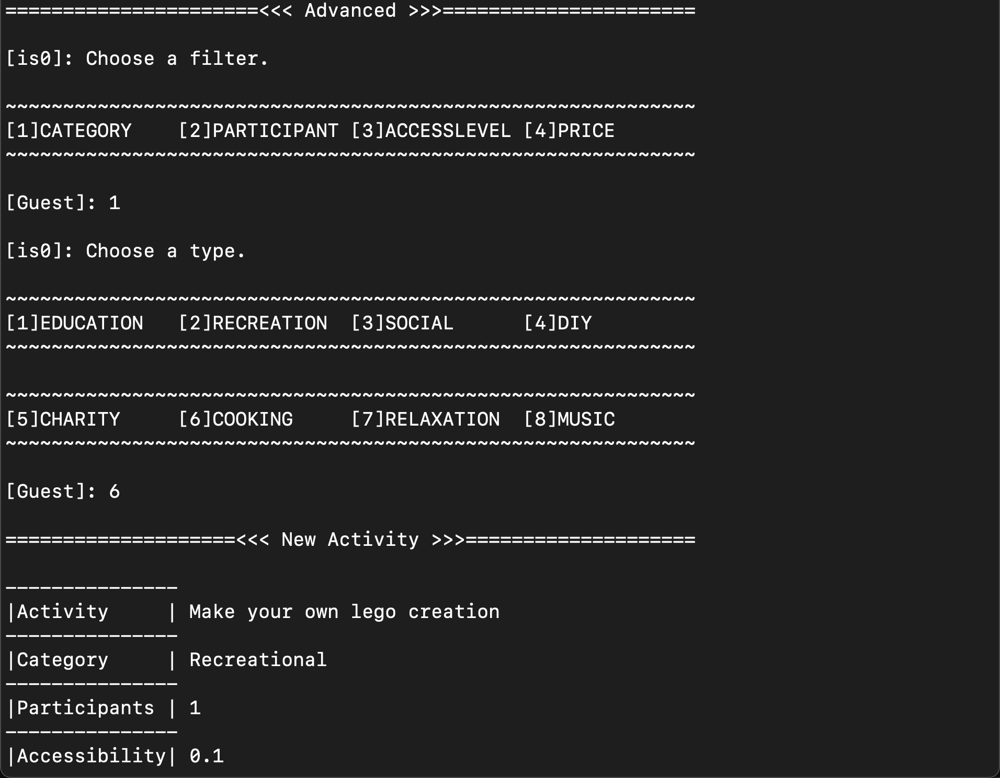
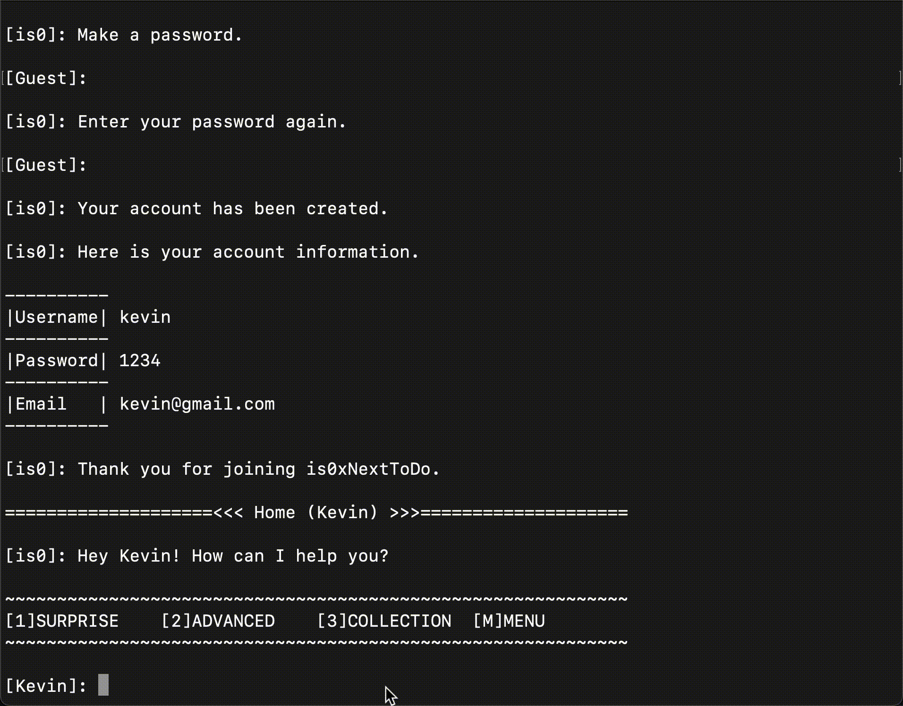

# is0xNextToDo

## Table of Content
* [About the Project](#about-the-project)
* [Getting Started](#getting-started)
* [Usage](#usage)
* [Demo](#demo)
* [Developed by and Support](#developed-by-and-support)

## About the Project
_is0xNextToDo_ is a **Command Line Applications** for finding a cool activity when the users are bored. It's not only support random searching, but it also possesses the filter functionality which can search by category, participant, accessibility, and price. Moreover, you can have a collection for saving your loved activities by creating your owned personal account.

## Getting Started
- Install gems
  > Type in terminal: `bundle install`
- Initialize the local database
  > Type in terminal: `rake db:create`
- Create required tables
  > Type in terminal: `rake db:migrate`
- Execute the application
  > Type in terminal: `ruby bin/run`
  
## Usage
- Account
  - **Login**: Login an existing account
  - **Create Account**: Create a new account by username, password and email
  - **Recovery Account**: Type in a username or email to recovery the user's account
  - **Update Password**: Change the password

- Activity
  - **View Activity**: Provide the information of the selected activity in a table
  - **Surprise:**: Find a random activity
  - **Advacned**: Find an activity by filter
  - **Save Activity**: Save the activity into the collection.
  - **Unsave Activity**: Remove the activity from the collection

- Collection
  - **Random**: Pick a random activity from the collection
  - **Pick**: Choose an activity from the collection 
  - **Sorted By**: Sort out the collection by category, participant, accessibility, and price

## Demo
- **Main Page**

  

- **Login**

  

- **Create Account**

  

- **Surprise**

  

- **Advanced**

  

- **Collection**

  

- **Save Activity**

  

- **Unsave Activity**

  

## Developed by and Support
- The application is developed by _[is0xjh25 (Yun-Chi Hsiao)](https://is0xjh25.github.io)_
- The activity list is provided by _[Bored API](https://www.boredapi.com/about)_
 

  

